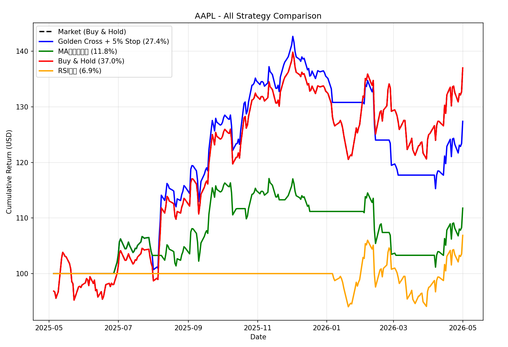
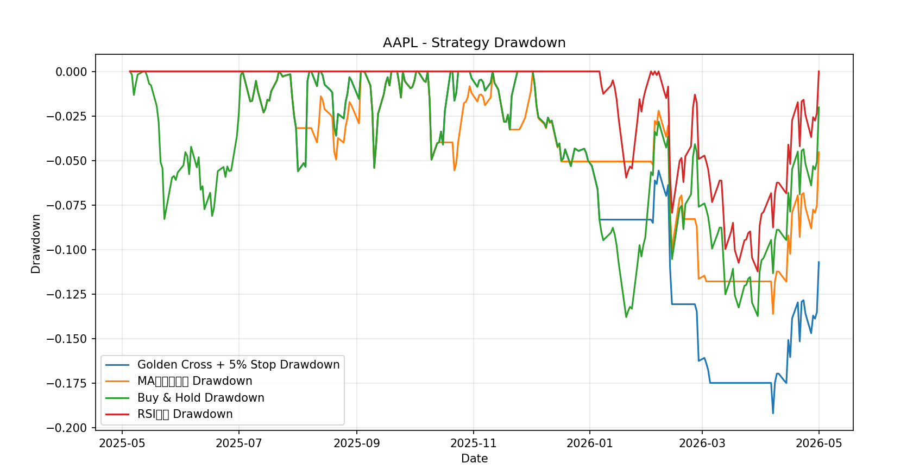

# Stock Strategy Backtest Tool

## 概要
株価データを用いて複数のトレーディング戦略をバックテストし、比較するツールです。

## 機能
- 株価データ取得（yfinance）
- 複数戦略の実装（MA, RSIなど）
- バックテスト
- 戦略の比較
- 最大ドローダウンの計算

## 使い方
1. 仮想環境を作成し、有効化します。
2. `pip install -r requirements.txt` で依存ライブラリをインストールします。
3. `python Quant/Quant\ Insight\ Engine.py` を実行し、銘柄コードを入力します。
4. バックテスト結果とグラフを確認します。

## 結果例

各戦略の累積リターンと最大ドローダウンを比較できます。

例：
- MA Cross: Return 15%, MaxDD -10%
- RSI: Return 22%, MaxDD -8%
- MACD: Return 12%, MaxDD -6%

※実際の結果は銘柄・期間に依存します。

## 主なファイル
- `Quant/backtests.py`: バックテスト戦略と集計ロジック
- `Quant/Quant Insight Engine.py`: データ取得、戦略実行、結果表示
- `save.py`: 単体バックテスト実行用の簡易スクリプト

## 今後の拡張
- 新しい戦略の追加（ボリンジャーバンド、MACDなど）
- 取引手数料とスリッページの実装
- 複数銘柄のポートフォリオバックテスト
- 結果のCSV出力やレポート生成
　
## 制作過程
本プロジェクトでは、AI（ChatGPT, GitHub Copilot）を活用しつつ、生成されたコードを一行ずつ理解しながら設計・実装を行いました。

## 学んだこと
- テクニカル分析には複数の手法があり、それぞれ特性が異なる
- テクニカル指標のみで安定して利益をだすことの難しさ
- コードを分割し、モジュール化することの重要性
- 外部ライブラリ(yfinance, pandas)の活用方法
- 生成されたコードを理解・修正する力の重要性
- テクニカル指標を数式からプログラムへ落とし込むプロセス

